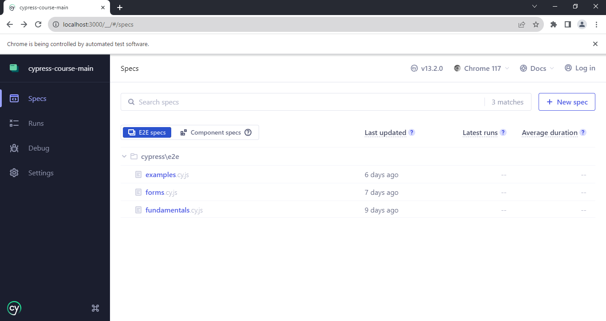
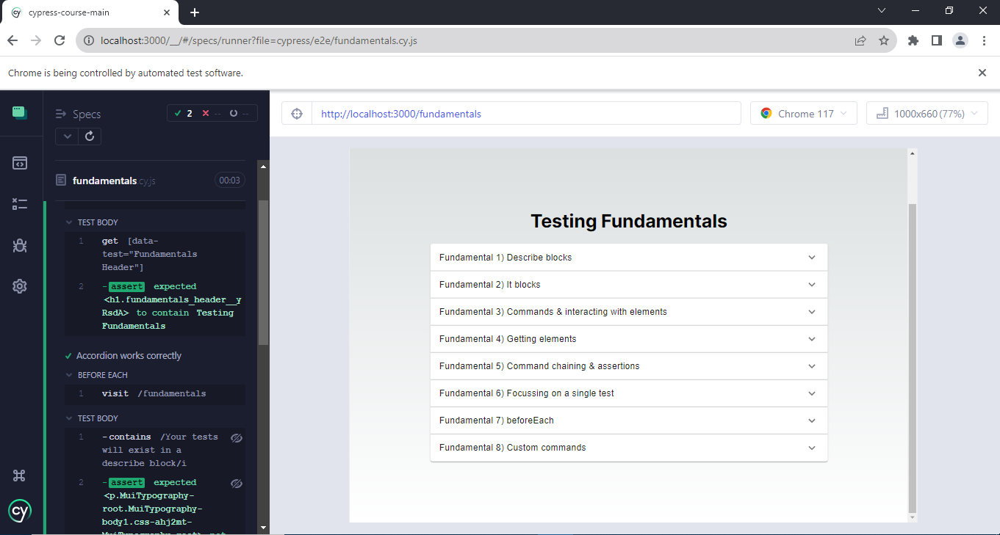
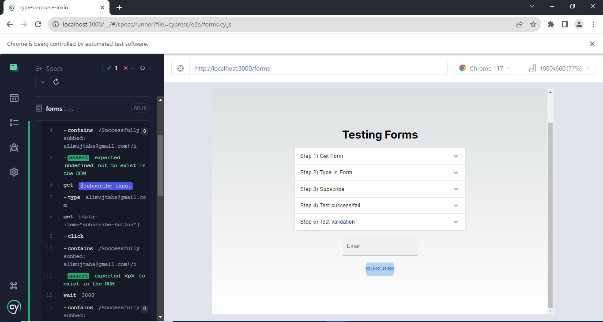
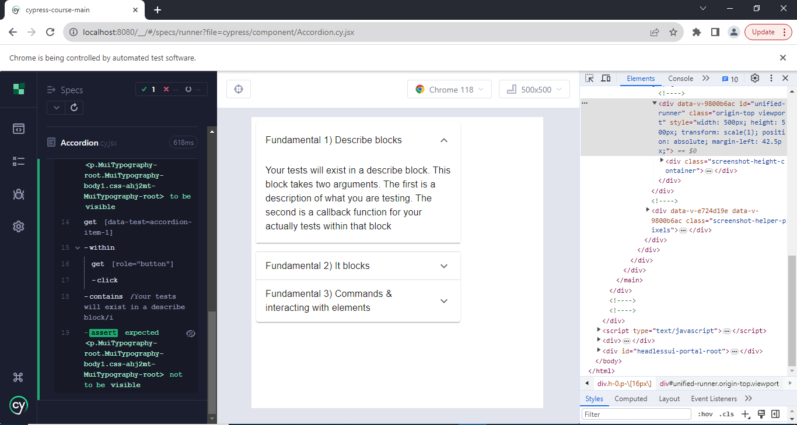

# Cypress Website Testing

This project contains automated test cases implemented with Cypress on a ReactJS website. 

The fundamentals of cypress have been implemented:
- describe blocks, it blocks, beforeEach method
- cy commands like visit, click, get, contains, should, wait, type, location, within, its etc
- multi-page testing
- many different assertions, custom cy commands, fixtures
- aliases, intercepts
- component tests

## Screenshots

 
 